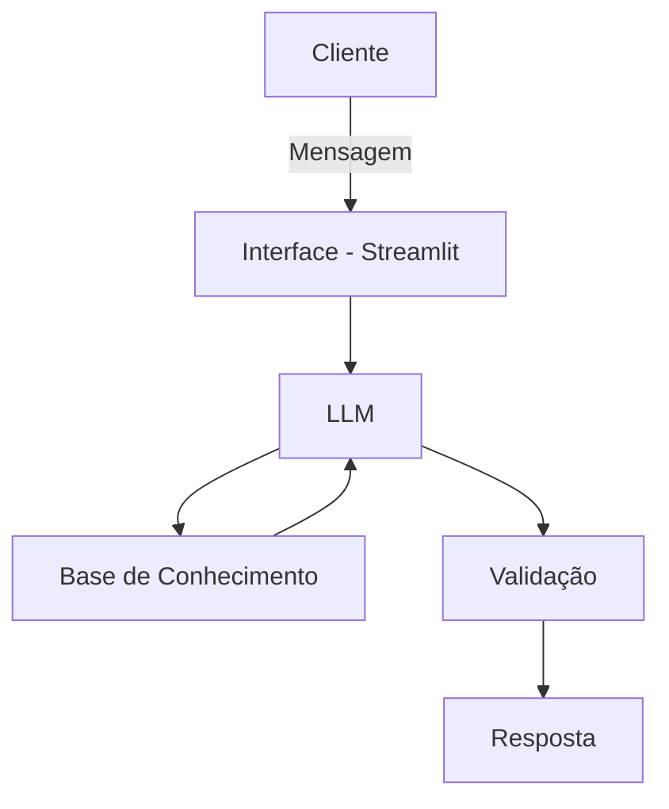

# 🤖 Edu — Educador Financeiro com IA Generativa

Agente conversacional que ensina finanças pessoais usando os próprios dados do cliente como exemplo, sem nunca recomendar investimentos específicos.

## O Problema

Muitas pessoas têm dificuldade em entender conceitos básicos de finanças (reserva de emergência, tipos de investimento, organização de gastos) e a educação financeira de qualidade costuma custar caro ou exigir tempo que o iniciante não tem.

## A Solução

O **Edu** é um educador financeiro pessoal: explica conceitos como juros compostos, Selic e orçamento usando o extrato e o perfil reais do cliente, em linguagem simples e sem jargão. Ele nunca recomenda produtos de investimento específicos — o foco é ensinar, para que a pessoa ganhe autonomia para decidir sozinha.

- **Público-alvo:** iniciantes em finanças pessoais
- **Personalidade:** educativo, paciente, didático, nunca julga os gastos do cliente
- **Tom:** informal e acessível, como um professor particular

## Arquitetura



## Segurança e Anti-Alucinação

- Só usa os dados fornecidos no contexto
- Nunca recomenda investimentos específicos, só explica como funcionam
- Admite quando não sabe algo
- Não acessa dados bancários sensíveis nem substitui um profissional certificado

## Estrutura do Repositório

```
├── README.md
├── docs/
│   ├── 01-documentacao-agente.md   # Caso de uso, persona e arquitetura
│   ├── 02-base-conhecimento.md     # Estratégia de dados
│   ├── 03-prompts.md               # System prompt, exemplos e edge cases
│   ├── 04-metricas.md              # Avaliação (assertividade, segurança, coerência)
│   └── 05-pitch.md                 # Roteiro do pitch (3 min)
├── data/                           # Dados mockados (cliente João Silva)
│   ├── transacoes.csv
│   ├── historico_atendimento.csv
│   ├── perfil_investidor.json
│   └── produtos_financeiros.json
├── src/                            # Código da aplicação (Streamlit)
└── assets/                         # Diagramas e material de apoio
```

## Base de Conhecimento

| Arquivo | Uso no Edu |
|---|---|
| `transacoes.csv` | Analisar padrão de gastos do cliente |
| `historico_atendimento.csv` | Contextualizar interações anteriores |
| `perfil_investidor.json` | Personalizar explicações ao perfil e às metas do cliente |
| `produtos_financeiros.json` | Explicar produtos de forma educativa (sem recomendar) |

Os dados são injetados no system prompt (ou consultados dinamicamente) no formato descrito em `docs/02-base-conhecimento.md`.

## Como Rodar

```bash
cd src
pip install -r requirements.txt
streamlit run app.py
```

## Avaliação

O Edu é avaliado em três métricas — **assertividade**, **segurança** (não inventar informação) e **coerência** com o perfil do cliente — combinando testes estruturados e feedback de usuários reais. Detalhes e casos de teste em `docs/04-metricas.md`.

## Pitch

Roteiro e demonstração de 3 minutos em `docs/05-pitch.md`.
